# Mercadolibre challenge

## Parte 1 del challenge

Problema técnico sugerido , conexión a un container en docker , orquestado por docker compose , con servidor en nginx.

__"Al momento de inicializar ​docker-compose vemos que todo levanta bien, pero no podemos acceder a los métodos de API."__

### ¿Cuál fue el problema?

El servidor nginx no estaba funcionando como un proxy inverso , la razón de ese comportamiento fue que dentro de las configuración no se redireccionaba a la api.
Adicionalmente hay que hacer un cambio en los archivos de configuración ya sea en el archivo `Docker-compose.yml` o en el `default.conf`

### ¿Cuál fue la solución?

Dentro del archivo de configuración en `default.conf` se pueden observar las siguientes líneas:
```
...
location / {
      proxy_set_header  Host $host;
      proxy_set_header  X-Real-IP $remote_addr;
}
...
```
Se modificaron a
```
...
location / {
    proxy_pass  http://app:8080;
    proxy_set_header  Host $host;
    proxy_set_header  X-Real-IP $remote_addr;
}
...
```
Con esto se resolvía el tema de la redirección a la api , pero también se debe tener en cuenta que cuando se trataba de acceder a http://localhost:8080  no nos podíamos conectar .Esto se debía a que dentro de la configuración original del servidor (`default.conf`) está escuchando el puerto 80 en vez del 8080 con el cual accedemos desde el externamente
```
Server {
    listen       80;
    server_name  localhost;
    ...
```
Si se cambia el parámetro `listen` al puerto `8080` se soluciona, como se muestra en el siguiente ejemplo.
```
Server {
    listen       8080;
    server_name  localhost;
    ...
```
###### Otra solución posible es

en el archivo de configuración `Docker-compose.yml` ,donde originalmente se encontraba así:
``` yaml
  version: '3'
  services:
    nginx:
      build: nginx
      ports:
        - "8080"
  ...
```
reemplazar el parámetro ` ports` por `8080:80` donde el container internamente usa el puerto 80 y el puerto 8080 se encuentra expuesto para acceder externamente
``` yaml
  version: '3'
  services:
    nginx:
      build: nginx
      ports:
        - "8080:80"
  ...
```

### Qué aprendí

> Principalmente lo que aprendí en esta parte del challenge fue como es el funcionamiento de docker, cómo se gestiona y se puede configurar un entorno de desarrollo utilizando docker-composite con un archivo yaml , ademas de su fácil integración con github
>
> Funcionamiento de nginx, había trabajado con XAMMP pero nunca tuve que acceder a la configuración del servidor apache, realmente no es muy complicado realizar una configuración en un servidor nginx, Adicionalmente aprendí luego de unas extensas horas y un duro análisis de por qué no se aplicaban los cambios en el container de nginx que si no corro un `docker-compose build` antes del `docker-compose up` , no actualiza los cambios

## Parte 2 del challenge

### Descripción de la aplicación realizada:
La aplicación consiste en 5 Endpoints en los cuales dos ya se encontraban proporcionados , los cuales permiten crear y buscar un item en la base de datos , inicialmente estaba configurado para Sqlite y se pasó a Mysql.
Los 3 Endpoint restantes permiten
* Buscar si un archivo almacenado en google drive ,contiene una palabra
* Crear un archivo de texto plano sin contenido en google driver
* Un callback que permite generar el token para la autenticación con google drive , y almacenarlo en una variable de session.

__workflow__



* Si el usuario quiere crear o buscar un item accede directamente a la URL
* Si el usuario quiere crear o buscar un archivo:
  - Si se encuentra Autenticado accede a la url indicada
  - Si no se encuentra Autenticado , el middleware  primero guardar la url original y los datos para crear un archivo (si los tuviera), lo redirecciona a la URL de google para autenticar, luego de que se autentique es redireccionado a callback.

* El callback recupera la url original y guarda el código para generar el token y redirecciona a la url original
 * El `GET` actúa normalmente ya que los parámetros pasan por url
 * El `POST` verifica si tiene en una variable session un error en los parámetros o un json con el título y la descripción, si no los tiene lo toma de el context

* ### Conexión con MYSQL

##### ¿Cuál fue el problema?

  Había que realizar el cambio de base de datos de Sqlite a Mysql server.

  ##### ¿Cuál fue la solución?

  Para realizar el cambio de base de datos no hubo mayores inconvenientes solamente fue crear el nuevo esquema, cambiar una línea para la conexión a la base de datos y agregar un nuevo repositorio `github.com/go-sql-driver/mysql` dentro del `Dockerfile`.
  El mayor tiempo utilizado fue investigar sobre los repositorios disponibles y ver documentación sobre la configuración para la conexión a Mysql

  ``` Go
  ...
  func configDataBase() *sql.DB {
      db, err := sql.Open("mysql", fmt.Sprintf("%s:%s@tcp(%s:3306)/%s?charset=utf8", "user", "userpwd", "db", "db"))
    ...
  ```
  ``` Go
  ...
  func createTable(db *sql.DB) {
      // create table if not exists
      sql_table := `
      CREATE TABLE IF NOT EXISTS items(
          id INTEGER NOT NULL AUTO_INCREMENT PRIMARY KEY,
          name VARCHAR(255),
          description VARCHAR(255)
      );`
      ...
  ```

* ### Autenticación con Oauth2

##### ¿Cuál fue el problema?

Uno de los principales problemas es como manejar la autenticación,las librerías disponibles para utilizar con go.

##### ¿Cuál fue la solución?

La forma de cómo resolver la autenticación fue unas de las tareas que requirió más tiempo del que tenía pensado,debido a que para tratar de mantener los Endpoints originales propuestos en el challenge decidí no crear 2 endpoints adicionales (los cuales serían para loguearse y para desloguearse), decidí utilizar el criterio de que cuando no se tiene la autorización para acceder a los servicios del drive , lo redireccione la url que brinda google para autenticar al usuario, esto conllevo a una mayor dificultad para probar con Postman.
Como en el caso anterior la mayoría del tiempo para implementar la solución la encontré en primero aprender cómo funciona el modelo de autenticación , luego en la búsqueda de documentación de cómo se encontraba implementado en golang.

* ### La Api de Google Drive

##### ¿Cuál fue el problema?
* La utilización de la libreria `google.golang.org/api/drive/v3`,
* Buscar si un archivo tiene una palabra
* Crear un archivo en google drive

##### ¿Cuál fue la solución?

Al inicio me habia basado en el modelo que propone en  https://developers.google.com/drive/api/v3/quickstart/go , debo reconocer que comprender en su totalidad lo que hacia ese ejemplo me llevo tiempo,no obstante debo mensionar que  no me convencia la forma en la cual recibia el código de autorización ,y posteriormente creaba y almacenaba en un archivo plano un token en el servidor, esto conllevo a que vea la forma para autenticar, aprendiera un poco sobre el funcionamiento del oauth2.
Cuando logre obtener el token necesario para generar un cliente y este me provea del servicio del drive, note que a pesar que en la documentación está claramente explicado cómo es la utilización de rest api de google drive, al utilizar  `google.golang.org/api/drive/v3` tuve que investigar cómo estaban implementados los servicios que provee google drive, y hasta en algunas ocasiones por la falta de documentación para la librería , fue directamente leer el código ,entender cómo funcionaba y cómo implementarlo.
Buscar si un archivo tiene una palabra esto fue algo que me sorprendió , no hay forma directa para saber si un archivo tiene esa palabra en su contenido,título o descripción, la única forma por la documentación de google que encontré fue ,la solución que opte para implementar consiste en primero verificar si existe el id ingresado, si existe  obtener una lista de archivos los cuales tiene la palabra indicada agregando el filtro que tengan el mismo nombre que el archivo ingresado y fecha de creación , y buscar dentro de la lista de archivos si existe alguno con la id ingresada.
Para la creación de dentro del drive, no hubo mayores dificultades , solamente la decisión de no crear un archivo plano y subirlo al drive, debido a que no tenia ningun contenido para agregar al archivo , asi que directamente creo un archivo dentro del drive con los parámetros pasados (Título y Descripción).

* ### El manejo de sessiones

##### ¿Cuál fue el problema?
* Una manera de manera de preservar la url y los posibles datos ingresados
* Librerías disponibles para utilizar en go
* No persistencia de datos en la sesión

##### ¿Cuál fue la solución?

Una dificultad con la cual tuve que lidiar fue que al momento de autenticar con google al redireccionar pierdo el contexto , por lo tanto perdía la url a la cual se había accedido originalmente , además en el caso de que sea un post se pierden los datos ingresados. Para solucionar eso necesitaba una forma de persistir esos datos, una solución pudo ser almacenar esos datos en una cookie , pero como tambien tenia la intención de almacenar el token que obtenía al autenticar en google opte por almacenarlos en sessions, otra alternativa hubiera sido almacenarlos en un servidor estilo Redis pero esta opción cambiaria la arquitectura propuesta.
Por alguna extraña razón tuve la complicación de que en la sesión no tenía persistencia , luego de muchos intentos , muchas horas y borrar la session en el navegador que estaba utilizando , funcionó correctamente.


##  Conclusiones

Realmente en la dificultad del proyecto la pude encontrar en la utilización de las tecnologías propuestas con las cuales nunca antes había trabajado como por ejemplo docker , o tuve que configurar un servidor como nginx. Programar en Golang fue volver a pensar en estructurado, tener que investigar mucho más de lo común y hasta incluso leer código fuente de las librerías para poder entender y aplicar las funcionalidades que posee o que la comunidad brinda. pero a su vez me permitió experimentar con un lenguaje con nuevas reglas como, que una función puede retornar 2 valores , o la facilidad con la cual se puede levantar un servidor http, o lo preparado que esta para la concurrencia,a su vez con `gin gonic`  vi lo fácil que es manejar rutas , validaciones y que la documentación que presentan es más que útil.
Fue la primera vez que me tocó programar una REST API, entender la metodología ,el funcionamiento general, cómo funciona la autenticación, en resumen puedo asegurar que fue reto en varios niveles al enfrentarme a con tantas tecnologías , técnicas y metodologías  pero así mismo me dejó un montón de nuevos conocimientos, preguntas y  ganas de seguir aprendiendo,jugando y experimentando sobre los mismos.
